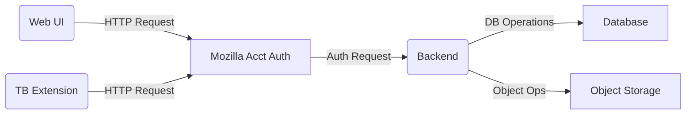
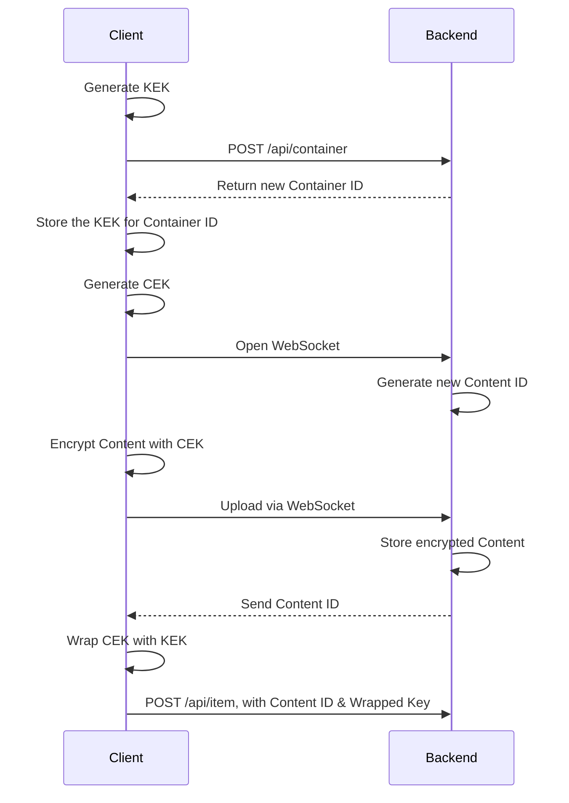
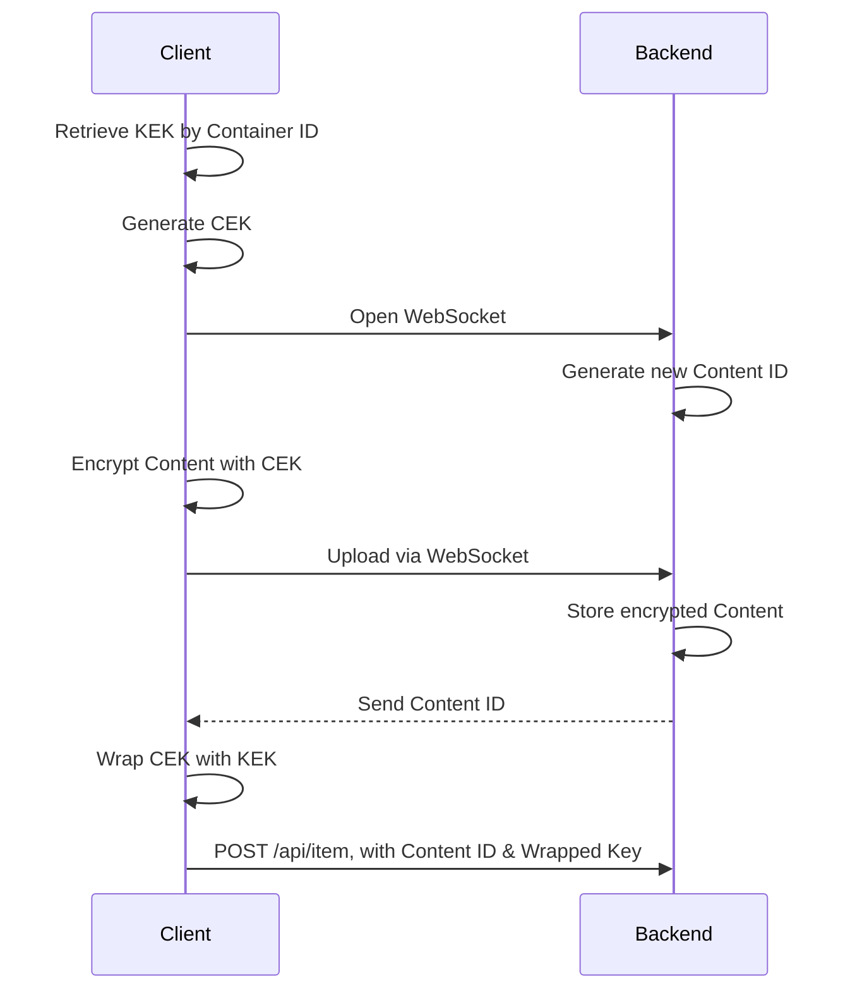
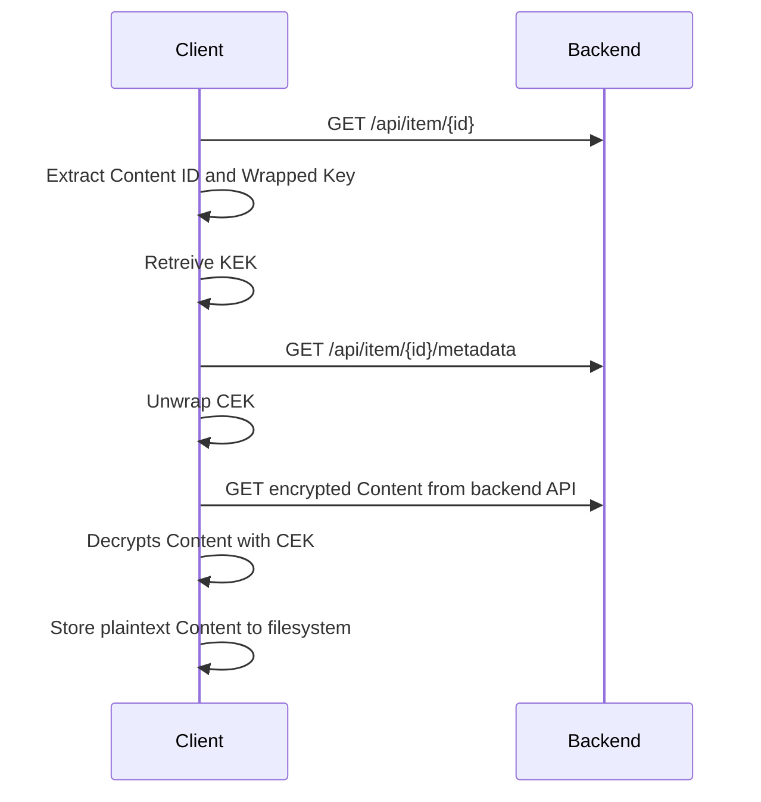

# Introduction

## Overview

Lockbox is a web application and Thunderbird Extension that gives paid users the ability to:

- store and manage encrypted files in Lockbox's cloud storage
- create encrypted email attachments in Thunderbird, either uploaded from their filesystem or directly from Lockbox
- send end-to-end encrypted files to other paid users or to anonymous users
- protect access to files with a password
- create access links that expire after a period of time

## Background

A previous Mozilla product, Firefox Send allowed anonymous users encrypt and share files. It was shut down due to abuse by cybercriminals and a lack of reporting mechanisms.

Lockbox intends to address these issues and expand to use cases beyond simple file sharing.

## Goals

- allow the storing and sharing of files in a privacy-respecting way.
- provide true end-to-end encryption, never storing or transmitting an encryption key in plaintext.
- deter abuse by requiring a paid account in order to upload or send files.
- automatically submit any public links to files to trusted services that will scan for malware and exploitative material.
- provide tools for reporting abuse.

## Non-Goals

We will not guarantee that the system is secure against sophisticated attacks by governments or other parties attempting to break the encryption.

# System Overview

## Terminology

(should these be alphabetized? Or kept in a "stacking order" so that reader can read from top to bottom without having to look up other definitions?)

|                              |                                                                                                                                   |
| ---------------------------- | --------------------------------------------------------------------------------------------------------------------------------- |
| Client                       | the frontend application running in the browser or as a Thunderbird Extension                                                     |
| Backend                      | the API, database, and storage.                                                                                                   |
| User                         | person who interacts with the Client.                                                                                             |
| Paid User                    | User with an active, paid subscription.                                                                                           |
| Access Link                  | unique URL that allows a User (paid or anonymous) to access encrypted file storage.                                               |
| Anonymous User               | User who does not have an active, paid subscription. Access Links provide them with limited use of the software.                  |
| ciphertext                   | the encrypted version of a file.                                                                                                  |
| plaintext                    | the unencrypted version of a file; does not actually mean that the contents are "plain text".                                     |
| Content Encryption Key (CEK) | the 256 bit, AES-GCM key used to encrypt and decrypt the contents of a file.                                                      |
| Key Encryption Key (KEK)     | the 256 bit, AES-KW key used to wrap and unwrap a Content Encryption Key.                                                         |
| Wrapped Key                  | CEK encrypted with a KEK.                                                                                                         |
| Content                      | file that is encrypted with a CEK and stored by the backend. Every Content has a unique CEK.                                      |
| Container                    | "virtual folder" holding zero or more Items; can have zero or more sub-Containers. Every Container has a unique KEK.              |
| Folder                       | another name for a Container                                                                                                      |
| Item                         | represents the existence/availability of a Content entity in a particular Container; holds the Wrapped Key for a Content entity . |
| Permission                   | determines what interactions (viewing, uploading, sharing) a User is authorized to perform.                                       |
| Membership                   | associates a specific User with a set of Permissions.                                                                             |
| Group                        | associates zero or more Memberships with a specific Container.                                                                    |

# System Architecture

The `Client` is one of two frontend User Interfaces:

- The Web interface is a Vue.js application running in any modern browser.
- The Thunderbird Extension is the same Vue.js application, packaged as a priviledged extension that is included with the "Pro" Thunderbird offering.

Mozilla Accounts (formerly Firefox Accounts) serves as the authentication mechanism.

The Backend is a Express/Node.js application offering a RESTful HTTP API with WebSockets for uploads. It ensures that Users have the required permissions when attempting to access `Containers`, `Items`, and `Contents`.

In addition, the Backend stores data in a SQL database and cloud-based Object Storage.

# Encryption Design

a smattering of notes:

- CEK: 256 bit AES-GCM keys are used for encrypting file contents
  - these are never stored in plaintext, either on the client or on the server
- KEK: 256 bit AES-KW keys are generated for each folder

  - these are used for encrypting the CEKs, producing "Wrapped Keys"

- An encrypted file is called `Content`
  - Each `Content` has a unique CEK
- A `Container` is a folder
  - Each `Container` has a unique KEK
- When we want to make `Content` available in a `Container`, we do that by creating an `Item` in that `Container`.
  - Each `Item` holds the Wrapped Key, specific to the CEK of its `Content` and the KEK of the `Container` it resides in.

To download a plaintext version of a file, the Client must:

- have access to the KEK for the Container
- request (from the backend) the Wrapped Key and Content ID for an Item in that Container
- extract the CEK by using the KEK to decrypt the Wrapped Key
- request the ciphertext for the Content ID from the backend
- decrypt the ciphertext using the CEK

Within the Client, "copying" an Item from one folder to another means the Client must:

- have access to the KEK for the source Container and the target Container
- request (from the backend) the Wrapped Key and Content ID for original Item in the source Container
- extract the CEK by using the KEK to decrypt the Wrapped Key
- wrap the CEK using the target Container's KEK to create a new Wrapped Key
- create a new Item in the target Container with the Content ID and the new Wrapped Key

To "move" an Item:

- Repeat the steps involved in copying an Item
- Delete the original Item

To give access to another User, the Client must:

- have access to the KEK for the Container
- request the other User's public key from the backend
- wrap the KEK with the other User's public key
- send a POST to the backend API with the wrapped KEK and Container ID, creating an Invitation for the other User

To accept an Invitation to access a Container the Client:

- retrieves the Invitation details (Container ID and Wrapped Key) from the backend API
- retrieves the local User's private key from client storage
- extract the KEK by decrypting the Wrapped Key with their private key
- send a POST to the backend API to accept the Invitation
  - at which point the backend creates the corresponding Membership and Group associations

# Data Flow Diagrams

## File Upload and Encryption

When adding a file to a User's Lockbox, the Client handles key generation and storage, while the Backend acts as an API for the database and object storage layers.

### Uploading to a new Container

- Client generates Key Encryption Key (KEK)
- Client sends POST to backend API to create a new Container
- Backend sends new Container ID to client
- Client stores the KEK locally, associating it with the Container ID
- Client generates Content Encryption Key (CEK)
- Client opens WebSocket connection to Backend
- Backend generates a random (24 bit) identifier for the Content
- Client uses CEK to encrypt content as it is uploaded via WebSocket
- Backend stores encrypted content (to filesystem or object store)
- Upon completion, the server sends Content ID back to client
- Client creates a "wrapped key" by encrypting the CEK with the KEK
- Client sends POST to backend API to create a new Item, providing the Content ID and the wrapped key

### Upload to an existing Container

Provided the User has permission to access the Container and the KEK has been transferred to their Client:

- Client retrieves KEK for existing Container from client storage
- Client generates Content Encryption Key (CEK)
- Client opens WebSocket connection to Backend
- Backend generates a random (24 bit) identifier for the Content
- Client uses CEK to encrypt content as it is uploaded via WebSocket
- Backend stores encrypted content (to filesystem or object store)
- Upon completion, the server sends Content ID back to client
- Client creates a "wrapped key" by encrypting the CEK with the KEK
- Client sends POST to backend API to create a new Item, providing the Content ID and the wrapped key

## File Download and Decryption

Provided the User has permission to access the Container and the KEK has been transferred to their Client:

- Client retrieves JSON payload for Item from backend API
- Client gets ID and wrapped key for Content from Item's JSON payload
- Client retrieves KEK for existing Container from client storage
- Client sends GET to backend API for file metadata (i.e., size and mime type)
- Client obtains CEK for Content from wrapped key using the KEK
- Client downloads encrypted Content from backend API
- Client decrypts Content using CEK
- Client stores decrypted file to User's filesystem

## Sharing Folder Access with another Paid User

A Paid User can give another Paid User access to a Container in two ways:

- Create and send an Invitation within the application
- Generate an AccessLink and send through another means of communication (e.g., via email)

### Invitations

A Paid User directly invites another Paid User to a Container. The Invitation appears in the UI of the application.

The Recipient can choose to accept the Invitation. Should they accept, the shared Container is now available to that User.

### Access Links

An Access Link can be used by a Paid User or by Anonymous Users.

Optionally, an Access Link can be created with:

- a password that must be entered before it can be used
- an expiration date/time, after which it is no longer valid

If a Paid User uses an Access Link, that Container is available to them as if they were sent an Invitation.

If an Anonymous User uses an Access Link, that Container is visible to them in a restricted version of the Client UI.

#### Password protection

When using password protection, the KEK for the Container is wrapped using the password.

When visiting the URL for the Access Link, the Client prompts the User for a password.

This password is used to decrypt a ciphertext string (the "challenge text"). The resulting plaintext string is sent to the backend.

If the Backend determines that the plaintext matches the stored plaintext for the AccessLink, it sends the Wrapped Key to the Client.

The Client then uses the same password to unwrap the KEK, allowing them to decrypt and download any Content associated in the Container.

#### Passwordless Access Links

Technically, "passwordless" AccessLinks also have passwords; they are just auto-generated and added to the `hash` of the URL.

(show example here)

The full URL is not stored in the backend (TODO: reconsider this, if we're going to submit public AccessLinks for scanning).

When the URL for an AccessLink has a `hash`, the Client automatically puts this in the password field and submits the form.

The reason for this is to ensure that all Content stored in Lockbox is end-to-end encrypted, even if the user has no intention of "protecting" it with a password.
